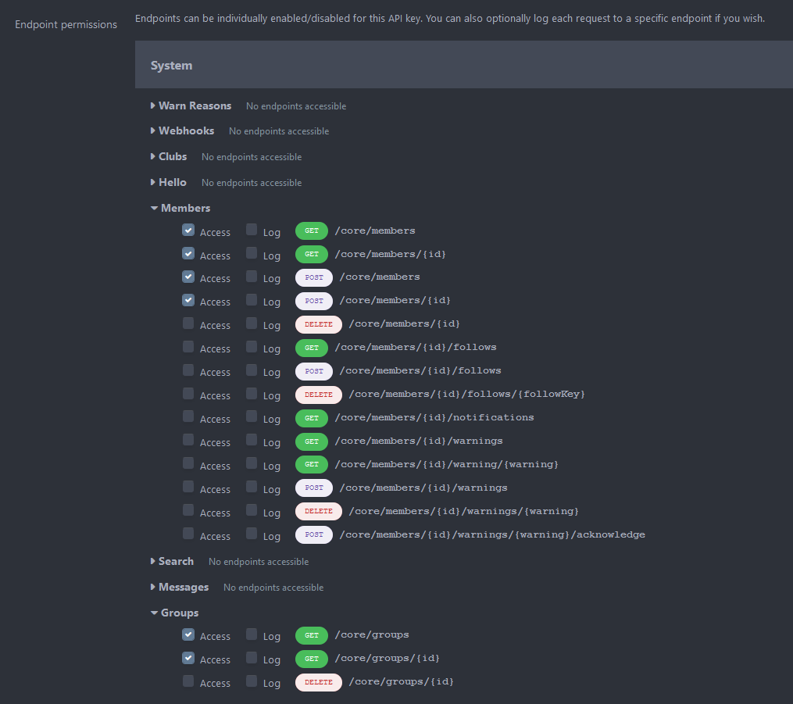

# SeAT Invision Community forums connector
A [SeAT](https://github.com/eveseat/seat) plugin which maintain user access on an Invision Community forum based on defined pattern.

## Setup

### Create Application
- Go to your forum Admin CP and navigate to the `REST & OAuth` page. Create a new API Key by clicking the `Create New` button on the API Keys tab.
- Give it a reference name; so user will be able to know what it is related to later.
-  Fill in the endpoint permissions, enabling `access` next to the required groups and members endpoints as shown:

- Once done, click on the `Save` at the bottom of the form.

### Install Package
Since SeAT 3.0 - it's become super easy to install package. Just require `anza-eve/seat-ipb-connector`, publish vendor and run migrations scripts :)

- Firstly, run the following command `composer require anza-eve/seat-ipb-connector`.
- Then, publish vendors `php artisan vendor:publish --force` (this will show you a prompt - input the number related to the following line `Anza\Seat\Connector\Ipb\IpbConnectorServiceProvider`).
- Finally, run migrations scripts with `php artisan migrate`

Don't forget to restart `supervisor` with `service supervisor restart`.

> **IMPORTANT**
>
> All upper command have to be run using the SeAT instance user `www-data`, `seat` or whatever you've done with your installation.
> They need to be run at root SeAT directory which used to be `/var/www/seat`

### Setup Package
Authenticate yourself using admin user on your SeAT instance. If all upper statements have been executed properly, you'll seed a new section into the sidebar called `Connector`.

Open it, then go into `Settings` and fill the form using collected information at the beginning of this Walkthrough. Confirm using the `Update` button.

Next, you can select `Forums` and hit the `Update Sets` green button which will seed SeAT with Groups available on your forum.

### Setup Access
To build the mapping between SeAT and IPB, go into `Connector > Access Management`.
In case you're seeing no groups in the form, go into `Connector > Settings` and hit the `Update Sets` button.

In **Forums**, there are 6 kind of mapping called `Filter`. Their scope are explained in the table bellow.

| Filter          | Description                                                                                        |
| --------------- | -------------------------------------------------------------------------------------------------- |
| **User**        | This filter is applied to specific user group (meaning all linked characters)                      |
| **Role**        | This filter is applied to all members of specific SeAT role (ACL)                                  |
| **Corporation** | This filter is applied to all user with at least one character inside a specific corporation       |
| **Title**       | This filter is applied to all user with at least one character owning a specific corporation title |
| **Alliance**    | This filter is applied to all user with at least one character inside a specific alliance          |
| **Squad**       | This filter is applied to all user with at least one character inside a specific squad             |
| **Public**      | This filter is applied to all user                                                                 |

To create a filter, simply fill the form available on the left accordingly to your needs. Then, hit the `Add` button.
At all time, you're able to check which filter are set in the table available on the right side. You can also drop mapping using the red `Remove` button near each mapping line.
